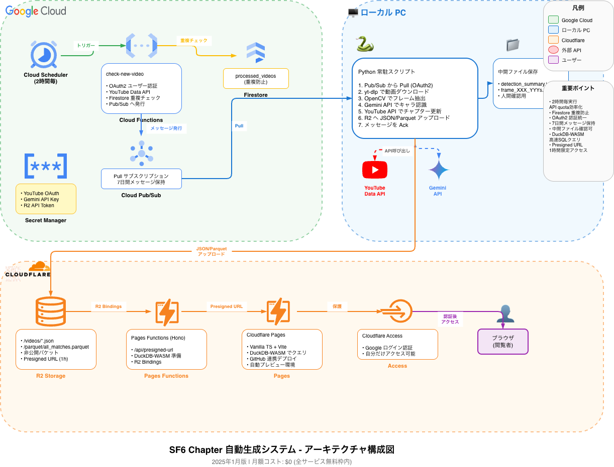

# SF6 Chapter

SF6（ストリートファイター6）のYouTube配信動画から対戦シーンを自動検出し、YouTubeチャプターを生成するシステム。

## 概要

YouTube配信動画から「ROUND 1」画面をテンプレートマッチングで検出し、Gemini APIでキャラクター名を認識、YouTubeの説明文にチャプターとして自動追加します。検出したデータはCloudflare R2に保存され、Webアプリケーションから検索可能です。

## アーキテクチャ

**Google Cloud + Cloudflare ハイブリッド構成**を採用。

```
[Google Cloud]
Cloud Scheduler (2時間毎)
    → Cloud Functions (新動画検知、OAuth2認証、Firestore重複防止)
    → Cloud Pub/Sub (メッセージキュー、7日間保持)

[ローカルPC]
Python常駐スクリプト
    → Pub/SubからPull
    → yt-dlpで動画ダウンロード
    → OpenCVでフレーム抽出・テンプレートマッチング
    → Gemini APIでキャラクター認識
    → YouTube Data APIでチャプター更新
    → Cloudflare R2へJSON/Parquetアップロード

[Cloudflare]
R2 (ストレージ、非公開)
    → Pages Functions (Hono) - APIエンドポイント
    → DuckDB-WASMでParquetをクエリ
    → Pages (静的サイト) - フロントエンド
    → Access (認証)
```



## 主な機能

- **対戦シーン自動検出**: OpenCVテンプレートマッチングで「ROUND 1」画面を検出
- **キャラクター認識**: Gemini APIで対戦キャラクターを自動認識・正規化
- **YouTubeチャプター生成**: YouTube Data APIで動画説明文にチャプターを自動追加
- **対戦データ検索**: DuckDB-WASMによるクライアントサイドSQL検索
- **重複処理防止**: Firestoreで処理済み動画を追跡

## 技術スタック

### ローカル処理 (packages/local)

| 技術 | 用途 |
|------|------|
| Python 3.11+ | ランタイム |
| uv | パッケージ管理 |
| yt-dlp | 動画ダウンロード |
| OpenCV | テンプレートマッチング |
| Gemini API (Vertex AI) | キャラクター認識 |
| YouTube Data API | チャプター更新 |
| boto3 | R2アップロード (S3互換) |
| PyArrow | Parquet生成 |

### GCP Functions (packages/gcp-functions)

| 技術 | 用途 |
|------|------|
| Python 3.12 | ランタイム |
| Cloud Functions | 新動画検知 |
| Cloud Scheduler | 2時間毎の定期実行 |
| Cloud Pub/Sub | メッセージキュー |
| Firestore | 重複防止・状態管理 |

### Web (packages/web)

| 技術 | 用途 |
|------|------|
| Hono | Webフレームワーク |
| TypeScript | 型安全 |
| Vite | ビルドツール |
| DuckDB-WASM | クライアントサイドSQL |
| Cloudflare Pages | デプロイ |
| Cloudflare R2 | データストレージ |

## リポジトリ構成

```
sf6-chapter/
├── packages/
│   ├── local/                    # ローカルPC用Python処理
│   │   ├── src/
│   │   │   ├── pubsub/           # Pub/Sub受信
│   │   │   ├── firestore/        # 重複防止
│   │   │   ├── video/            # 動画ダウンロード
│   │   │   ├── detection/        # 対戦シーン検出
│   │   │   ├── character/        # キャラクター認識
│   │   │   ├── youtube/          # チャプター更新
│   │   │   └── storage/          # R2アップロード
│   │   ├── main.py               # エントリーポイント
│   │   ├── Dockerfile            # Docker化対応
│   │   └── pyproject.toml
│   │
│   ├── gcp-functions/
│   │   └── check-new-video/      # 新動画検知Cloud Function
│   │
│   └── web/                      # Cloudflare Pages + Functions
│       ├── src/
│       │   ├── server/           # Hono (APIルート)
│       │   ├── client/           # DuckDB-WASM検索
│       │   └── shared/           # 共通型定義
│       ├── wrangler.toml
│       └── package.json
│
├── schema/                       # 共通JSONスキーマ
│   ├── video.schema.json
│   ├── match.schema.json
│   └── character_aliases.schema.json
│
├── config/                       # 設定ファイル
│   └── character_aliases.json    # キャラクター名正規化テーブル
│
├── docs/
│   ├── adr/                      # アーキテクチャ決定記録
│   └── architecture.drawio       # 構成図
│
└── CLAUDE.md                     # プロジェクト詳細仕様
```

## セットアップ

### 前提条件

- Python 3.11+ (ローカル処理)
- Node.js 20+ / pnpm (Web)
- uv (Pythonパッケージ管理)
- Docker (オプション、常駐PC用)
- Google Cloud アカウント
- Cloudflare アカウント

### クイックスタート

#### 1. ローカル処理のセットアップ

```bash
cd packages/local
uv sync

# OAuth2認証（初回のみ、ブラウザが開く）
uv run python main.py --mode test --test-step download --video-id <VIDEO_ID>
```

詳細は [packages/local/README.md](packages/local/README.md) を参照。

#### 2. Webアプリケーションのセットアップ

```bash
cd packages/web
pnpm install
pnpm dev
```

詳細は [packages/web/README.md](packages/web/README.md) を参照。

### 環境変数

#### ローカル処理 (.env)

```bash
# Google Cloud
GOOGLE_CLOUD_PROJECT=your-project-id
PUBSUB_SUBSCRIPTION=projects/your-project-id/subscriptions/new-video-trigger

# Gemini API (Vertex AI経由)
GEMINI_PROJECT_ID=your-project-id

# Cloudflare R2
R2_ACCESS_KEY_ID=your-token-id
R2_SECRET_ACCESS_KEY=your-token-value-sha256-hash
R2_ENDPOINT_URL=your-account-id.r2.cloudflarestorage.com
R2_BUCKET_NAME=sf6-chapter-data
```

## 実行方法

### ローカル処理

```bash
cd packages/local

# 常駐モード（Pub/Subストリーミング受信）
uv run python main.py --mode daemon

# ワンショットモード（1回だけPull）
uv run python main.py --mode once

# テストモード（個別処理）
uv run python main.py --mode test --test-step all --video-id <VIDEO_ID>
```

### Docker（常駐PC推奨）

```bash
cd packages/local
docker compose up -d
```

詳細は [packages/local/DEPLOYMENT.md](packages/local/DEPLOYMENT.md) を参照。

### Webアプリケーション

```bash
cd packages/web

# 開発サーバー
pnpm dev

# ビルド & デプロイ
pnpm deploy
```

## ドキュメント

### ADR (Architecture Decision Records)

重要なアーキテクチャ決定は `/docs/adr/` に記録しています。

| ADR | タイトル |
|-----|---------|
| [001](docs/adr/001-cloud-service-selection.md) | クラウドサービス選定 |
| [002](docs/adr/002-data-storage-search.md) | データ保存・検索基盤 |
| [003](docs/adr/003-repository-structure.md) | リポジトリ構成 |
| [004](docs/adr/004-oauth2-authentication-for-all-gcp-apis.md) | OAuth2認証の統一 |
| [005](docs/adr/005-r2-bucket-specific-api-token.md) | R2バケット専用APIトークン |
| [006](docs/adr/006-firestore-for-duplicate-prevention.md) | Firestoreによる重複防止 |
| [007](docs/adr/007-cloud-scheduler-interval-optimization.md) | Cloud Scheduler実行間隔最適化 |
| [008](docs/adr/008-oauth2-user-authentication-in-cloud-functions.md) | Cloud FunctionsでのOAuth2ユーザー認証 |
| [009](docs/adr/009-cloudflare-pages-to-workers-migration-strategy.md) | Cloudflare PagesからWorkersへの段階的移行戦略 |
| [010](docs/adr/010-parquet-presigned-url.md) | Parquetデータ取得方式（Presigned URL） |
| [011](docs/adr/011-intermediate-file-preservation.md) | 中間ファイル保存による人間確認フロー |
| [012](docs/adr/012-check-new-video-dedicated-service-account.md) | check-new-video Cloud Function専用サービスアカウント |
| [013](docs/adr/013-local-package-dockerization.md) | ローカル処理パッケージのDocker化 |
| [014](docs/adr/014-cloud-function-oidc-authentication.md) | Cloud FunctionのOIDC認証による保護 |
| [015](docs/adr/015-google-cloud-logging-integration.md) | Cloud Functionsでのgoogle-cloud-logging統合 |
| [016](docs/adr/016-vite-manifest-based-asset-reference.md) | Viteマニフェストベースのアセット参照 |

## 認証方式

### Google Cloud API

すべてのAPI呼び出しでOAuth2認証を使用（詳細: [ADR-004](docs/adr/004-oauth2-authentication-for-all-gcp-apis.md)）

- YouTube Data API
- Vertex AI (Gemini API)
- Cloud Pub/Sub
- Cloud Firestore

### Cloudflare R2

- **ローカル処理**: R2バケット専用APIトークン（SHA-256ハッシュ化）
- **Pages Functions**: R2 Bindings
- **フロントエンド**: Presigned URL経由（有効期限1時間）
- **認証保護**: Cloudflare Access

詳細は [ADR-005](docs/adr/005-r2-bucket-specific-api-token.md)、[ADR-010](docs/adr/010-parquet-presigned-url.md) を参照。

## ライセンス

MIT
