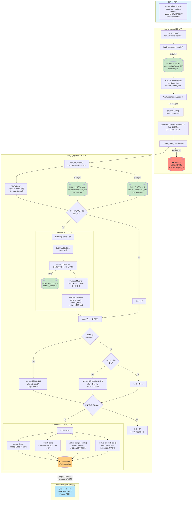

# チャプター処理フロー

`--mode test --test-step chapters --from-intermediate` 実行時の処理フローと、各データストアへの反映を図示したドキュメント。

## 対象コマンド

```bash
uv run python main.py --mode test --test-step chapters --video-id <VIDEO_ID> --from-intermediate
```

## 処理フロー図



## データの流れまとめ

### 入力（ローカルファイル）

| ファイル | 内容 |
|----------|------|
| `./intermediate/{video_id}/chapters.json` | 検出済みチャプター（startTime, title, winner_side等） |
| `./intermediate/{video_id}/matches.json` | 対戦データ（player1/player2のキャラ情報等） |

### 出力先 1: YouTube（説明欄チャプター）

`chapters.json` のデータが `YouTubeChapterUpdater.update_video_description()` を通じて **YouTube動画の説明欄** に反映される。

形式:
```
0:00 本編開始
0:47 GOUKI VS JP
2:15 CHUNLI VS GUILE
...
```

### 出力先 2: Cloudflare R2（`ENABLE_R2=true` の場合のみ）

| R2キー | 元データ | 内容 |
|--------|----------|------|
| `videos/{video_id}.json` | `matches.json` + YouTube API | 動画メタデータ + チャプター一覧 |
| `matches/{match_id}.json` | `matches.json` + Battlelog | 個別対戦データ（result含む） |
| `videos.parquet` | 上記JSONの集約 | 検索用（videoId単位で置換） |
| `matches.parquet` | 上記JSONの集約 | 検索用（videoId単位で置換） |

R2にアップロードされたParquetファイルは、Cloudflare Pages FunctionsのPresigned URL経由でフロントエンドに配信され、DuckDB-WASMでクエリされる。

### result フィールドの決定優先順位

1. **Battlelog API** の対戦結果（`SF6_PLAYER_ID` + `BUCKLER_ID_COOKIE` 設定時）
2. **RESULT画面テンプレートマッチング** の `winner_side`（フォールバック）
3. `None`（どちらも利用不可の場合）

## 関連する環境変数

| 変数名 | 用途 | デフォルト |
|--------|------|-----------|
| `INTERMEDIATE_DIR` | 中間ファイルの保存先 | `./intermediate` |
| `ENABLE_R2` | R2アップロードの有効化 | `false` |
| `R2_ACCESS_KEY_ID` | R2 APIキー | （`ENABLE_R2=true` 時に必須） |
| `R2_SECRET_ACCESS_KEY` | R2 APIシークレット | （`ENABLE_R2=true` 時に必須） |
| `R2_ENDPOINT_URL` | R2エンドポイント | （`ENABLE_R2=true` 時に必須） |
| `R2_BUCKET_NAME` | R2バケット名 | `sf6-chapter-data` |
| `SF6_PLAYER_ID` | Battlelogプレイヤー ID | （任意、設定時にBattlelogマッチング実行） |
| `BUCKLER_ID_COOKIE` | Battlelog認証Cookie | （任意、`SF6_PLAYER_ID` と併用） |
| `BATTLELOG_CACHE_DB` | SQLiteキャッシュファイルパス | `./battlelog_cache.db` |

## 関連ドキュメント

- [TEST_MODE_GUIDE.md](TEST_MODE_GUIDE.md) - テストモード全体のガイド
- [ADR-011](adr/011-intermediate-file-preservation.md) - 中間ファイル保存
- [ADR-018](adr/018-intermediate-file-format-improvement.md) - 中間ファイル形式改善
- [ADR-021](adr/021-battlelog-chapter-mapping-implementation.md) - Battlelogマッピング
- [ADR-026](adr/026-result-screen-match-outcome-detection.md) - RESULT画面勝敗検出
